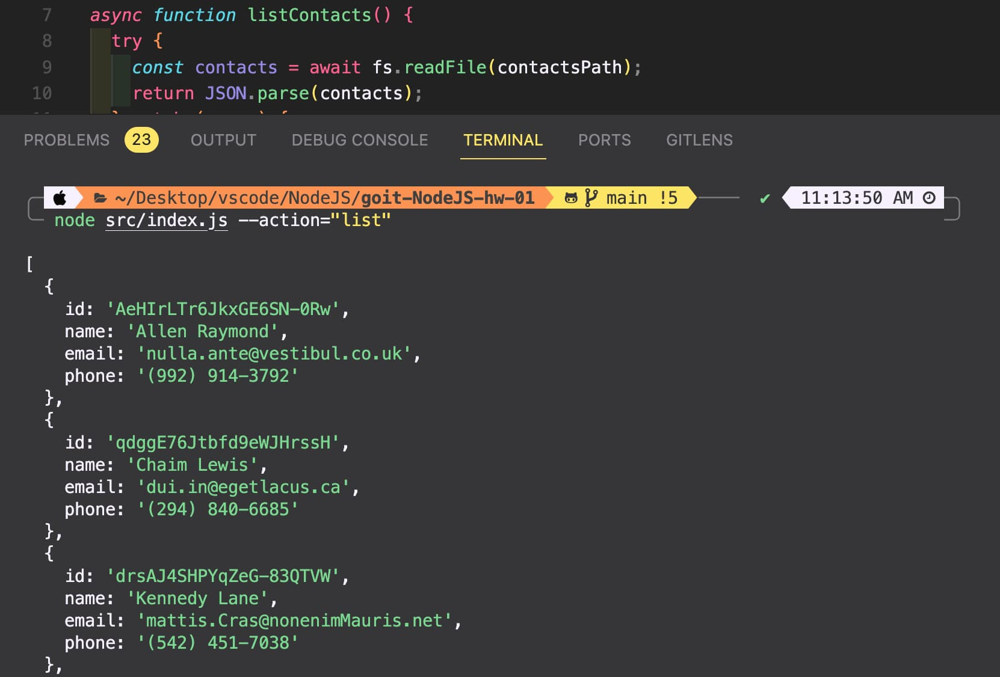
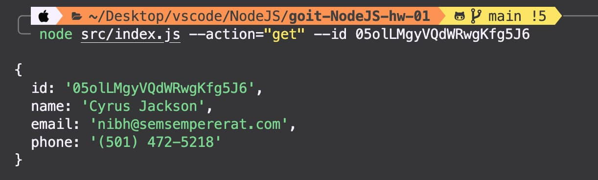
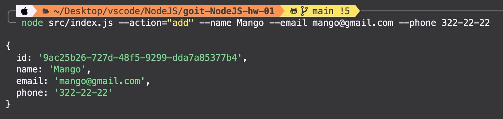
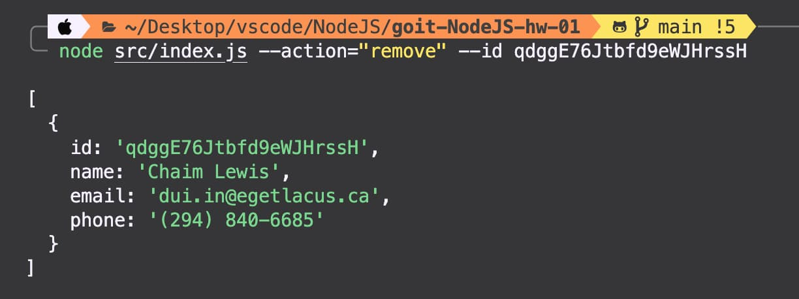

## CLI Contact Manager


[](https://github.com/Alexandrbig1/goit-NodeJS-hw-01/commits/main)
[](https://github.com/Alexandrbig1/goit-NodeJS-hw-01/blob/main/LICENSE)

This is a simple command-line interface (CLI) program built with  for managing contacts. It allows you to perform basic operations on a  file containing contact information such as ID, name, phone number, and email.

## Table of Contents

- [Features](#features)
- [Technologies](#technologies)
- [How to Use](#HowtoUse)
- [Examples](#Examples)
- [Screenshots](#Screenshots)
- [Issues](#Issues)
- [License](#License)
- [Feedback](#Feedback)
- [Connect with me](#Connectwithme)

## Features
- **View All Contacts:** Retrieve a list of all contacts stored in the  file.
- **Get Contact by ID:** Find a specific contact using their unique identifier.
- **Delete Contact by ID:** Remove a contact from the list based on their ID.
- **Add New Contact:** Append a new contact to the  file with a generated ID.

## Technologies Used
-  The runtime environment for executing the CLI program.
- **Commander:** A framework for building command-line applications, providing a clean and structured way to define commands and options.
- **uuid:** Used for generating unique IDs for each contact.
- **fs/promises:** File system module for handling file operations asynchronously.

## How to Use

1. **Install Dependencies:**
    ``` bash
    npm install
1. **Run the CLI:**
    ``` bash
    node src/index.js --<command> [options]

## Available Commands

- **list:** Display all contacts.
    ``` bash
    node src/index.js --action list
- **get:** Get contact by ID.
    ``` bash
    node src/index.js --action get --id <contactId>
- **remove:** Delete contact by ID.
    ``` bash
    node src/index.js --action remove --id <contactId>
- **add:** Add a new contact.
    ``` bash
    node src/index.js --action add --name <name> --email <email> --phone <phone_number>

## Examples

- **List all contacts:**
    ``` bash
    node src/index.js --action list
- **Get contact by ID:**
    ``` bash
    node src/index.js --action get --id 05olLMgyVQdWRwgKfg5J6
- **Remove contact by ID:**
    ``` bash
    node src/index.js --action remove --id qdggE76Jtbfd9eWJHrssH
- **Add a new contact:**
    ``` bash
    node src/index.js --action add --name "John Doe" --email "john.doe@example.com" --phone "+1234567890"

## Project Preview

### Screenshots:


_Caption for Screenshot 1 (listContacts)_


_Caption for Screenshot 2 (getContactById)_


_Caption for Screenshot 3 (addContact)_


_Caption for Screenshot 4 (removeContact)_

## Issues

If you encounter any issues or have suggestions, please [open an issue](https://github.com/Alexandrbig1/goit-NodeJS-hw-01/issues).

## License

This project is licensed under the [MIT License](LICENSE).

## Feedback

I welcome feedback and suggestions from users to improve the application's functionality and user experience.

## Languages and Tools:

<div align="center">  
<a href="https://www.javascript.com/" target="_blank"></a>
<a href="https://nodejs.org" target="_blank" rel="noreferrer"></a>
<a href="https://git-scm.com/" target="_blank" rel="noreferrer"> </a>
</div>

## Connect with me:

<div align="center">
<a href="https://linkedin.com/in/alex-smagin29" target="_blank">

</a>
<a href="https://github.com/alexandrbig1" target="_blank">

</a>
<a href="https://stackoverflow.com/users/22484161/alex-smagin" target="_blank">

</a>
<a href="https://dribbble.com/Alexandrbig1" target="_blank">

</a>
<a href="https://www.behance.net/a1126" target="_blank">

</a>  
</div>
